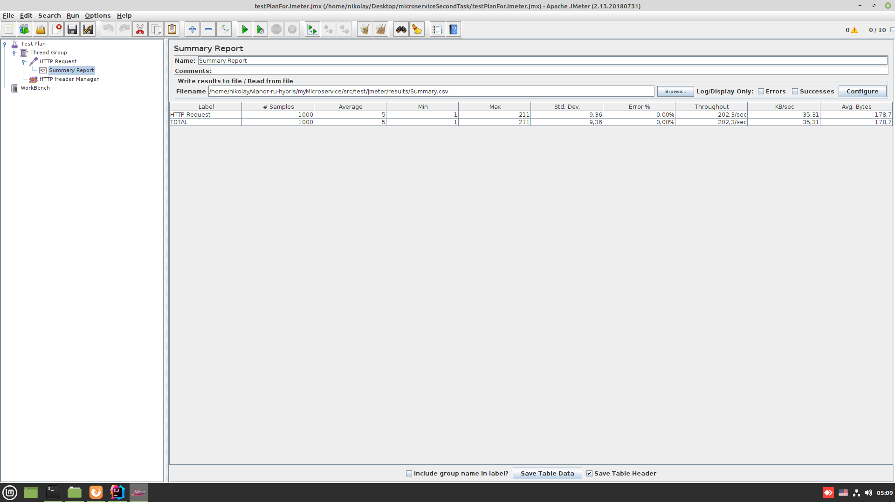
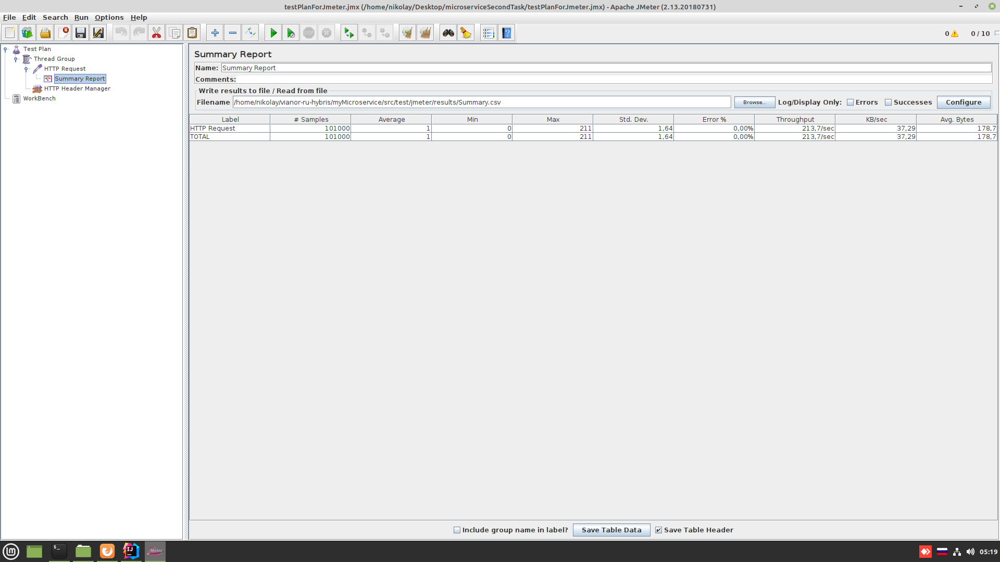

# Задача 2

1. Реализовать REST приложение, принимающее в запросе число и отправляющее его в топик Kafka. 
2. Реализовать приложение, читающее число из топика Kafka и сохраняющее его в таблицу БД.
3. Стек: Java/Kotlin, Spring Boot, Kafka, Docker, Docker Compose, Jmeter, любая БД.
    
**Для старта проекта в корне проекта выполнить "docker-compose up -d".**

**Результаты тестов (1000 запросов)**

**Результаты тестов (100к запросов)**

**Результаты тестов (1млн запросов)**

